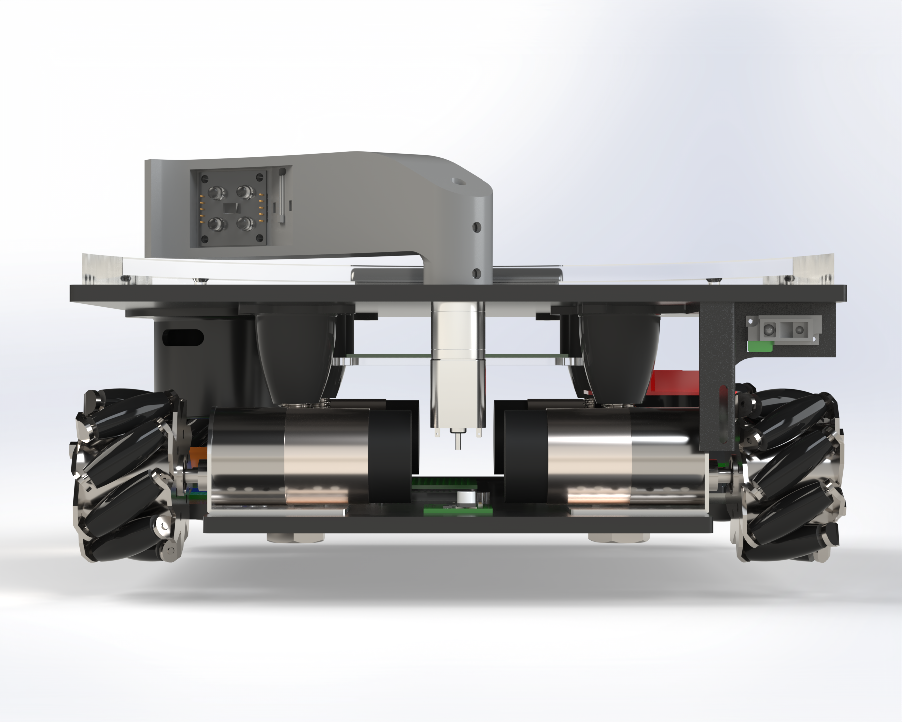

<h1 align="center">Mechatronics Competition Robot</h1>

  Co designed the electronics using Altium Designer and chassis using SolidWorks of a competition robot with three teammates. An Arduino was used to independently control five brushed DC motors with quadrature encoders using a position based closed loop PID controller, IIR, and FIR filters. The electronics were designed with thermal constraints in mind and were hand-assembled on prototype boards and custom PCBs using THT and SMT components. This project reflects the way I approach motion control, sensor integration, and fast-up on real hardware. The robotics competition can be viewed on YouTube at 00:10:24.

### Isometric View

  

### Front View

### Rear View
