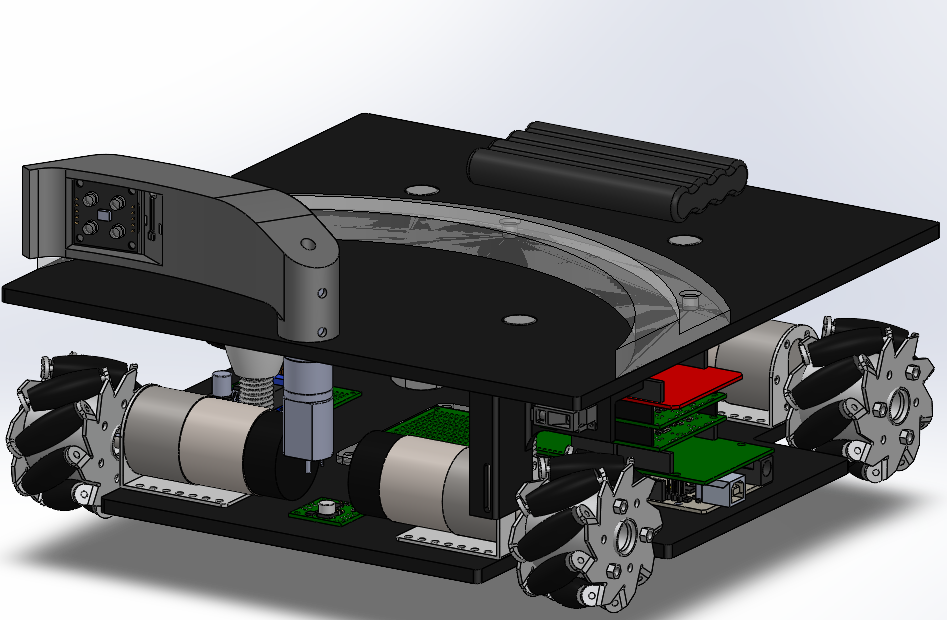

<h1 align="center">Mechatronics Competition Robot</h1>
  

    Co designed the electronics using Altium Designer and chassis using SolidWorks of a competition robot with three teammates. An Arduino was used to independently control five brushed DC motors with quadrature encoders using a position based closed loop PID controller, IIR, and FIR filters. The electronics were designed with thermal constraints in mind and were hand-assembled on prototype boards and custom PCBs using THT and SMT components. This project reflects the way I approach motion control, sensor integration, and fast-up on real hardware. 
  

<h2 align="center">▶️ Watch the Competition (starts at 10:24)</h2>
  

    
     Starts at <b>10:24</b>
  

<h3 align="center">Isometric View</h3>
  

    
  

<h4 align="center">Front View</h4>
  

    
  

<h5 align="center">Schematic</h5>
  

    
  
